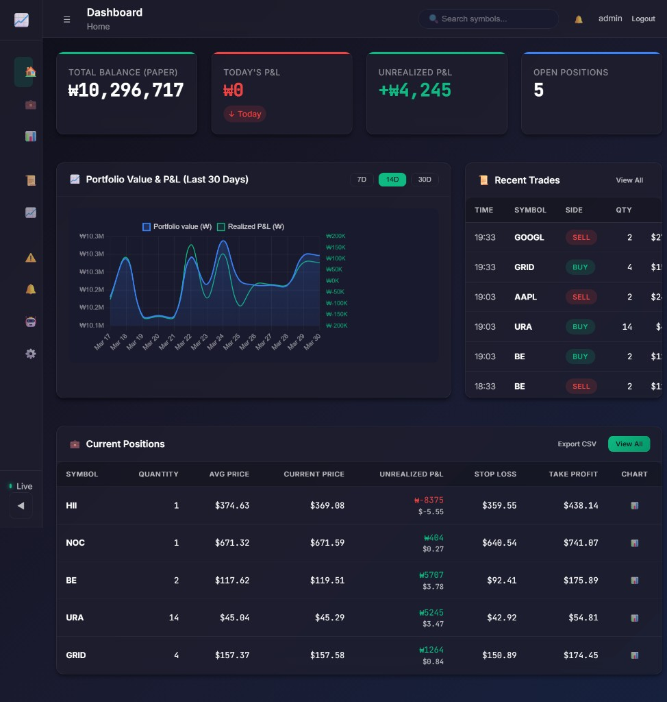
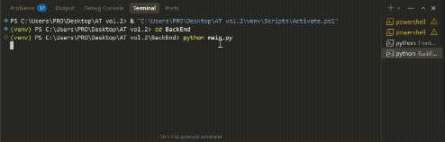

# AT vol.2 - AI-Powered Algorithmic Trading System



Live dashboard snapshot showing paper-trading balance, P&L trend, recent trades, and open positions in one screen.

[](https://youtu.be/As50peBs3wQ)

Short backend terminal demo clip of starting the trading engine and running `python main.py`. Click to view the full video log.

A production-ready, ML-enhanced algorithmic trading system for US stock markets that autonomously generates trading signals, executes trades, and manages risk using a hybrid approach combining technical analysis with machine learning.

## 🎯 Overview

This system combines:
- **Technical Analysis**: SMA, MACD, RSI, ATR indicators with multi-signal confirmation
- **Machine Learning**: LightGBM model that enhances signal confidence based on historical trade outcomes
- **Risk Management**: Multi-layered safety controls including circuit breakers, position sizing, and drawdown protection
- **Web Dashboard**: Django-based monitoring interface for real-time position tracking and performance analytics

## 🏗️ Project Structure

```
AT vol.2/
├── BackEnd/              # Trading engine and ML system
│   ├── main.py          # Main trading orchestrator
│   ├── modules/         # Core trading modules (20+ components)
│   ├── ml/             # Machine learning subsystem
│   ├── data_persistence/ # Database layer (SQLite)
│   └── tests/          # Test suite
├── FrontEnd/            # Django web dashboard
│   ├── trading_app/    # Main Django app
│   └── trading_web/    # Django project settings
└── requirements.txt    # Python dependencies
```

## 📥 Get the code

No GitHub account or key is required to get or run the code (when the repo is public).

- **With Git:** `git clone https://github.com/YOUR_USERNAME/AT-vol.2.git`
- **Without Git:** On GitHub, click **Code → Download ZIP**, then unzip.

**First-time setup:** Install Python 3.11+, create a virtual environment, run `pip install -r BackEnd/requirements.txt`, copy `accounts.yaml.example` to `accounts.yaml` and add your KIS credentials (use the `paper` section for paper trading), set `mode: "paper"` in `BackEnd/usa_stock_trading_config.yaml`, then run `cd BackEnd && python main.py`. Optionally start the web dashboard from `FrontEnd/` (see below).

## 🚀 Quick Start

### 1. Setup Environment

```bash
# Create virtual environment
python -m venv venv

# Activate (Windows)
.\venv\Scripts\Activate.ps1

# Activate (Linux/Mac)
source venv/bin/activate

# Install dependencies
pip install -r BackEnd/requirements.txt
```

### 2. Configuration

1. Copy `accounts.yaml.example` to `accounts.yaml` (in repo root or `BackEnd/`) and fill in your credentials:
   - **KIS:** Use the `paper` section for paper trading, `live` for live trading (matches `mode` in the main config).
   - **Discord:** Optional; add `bot_token` and `channel_id` under `discord` for trade notifications, or leave blank to disable.

2. Configure `BackEnd/usa_stock_trading_config.yaml`:
   - Set trading mode: `paper` (recommended for testing) or `live`
   - Configure symbols to trade
   - Adjust risk parameters and ML settings

### 3. Start Trading System

```bash
cd BackEnd
python main.py
```

### 4. Access Web Dashboard

```bash
cd FrontEnd
python manage.py runserver
```

The dashboard will be available locally. See [FrontEnd/README.md](FrontEnd/README.md) for details.

## ✨ Key Features

### Trading Engine
- **Hybrid Signal Generation**: Technical analysis + ML confidence boosting
- **Dual Modes**: Paper trading (simulation) and live trading (KIS API)
- **Automated Execution**: State machine-based order management
- **Position Persistence**: Automatic save/restore on restart

### Machine Learning
- **22-Feature Model**: LightGBM-based confidence booster
- **Continuous Learning**: Automated data collection and periodic retraining
- **A/B Testing**: Compare ML-enhanced vs. standard performance

### Risk Management
- **Circuit Breakers**: Automatic halt on losses or daily limits
- **Position Sizing**: ATR-based dynamic sizing
- **Drawdown Protection**: Multi-layered risk controls

### Web Dashboard
- **Real-time Monitoring**: Positions, P&L, trade history
- **Performance Analytics**: Win rate, statistics, charts
- **Risk Dashboard**: Circuit breaker events, exposure tracking

## 📚 Documentation

- **[BackEnd/README.md](BackEnd/README.md)** - Backend implementation details
- **[FrontEnd/README.md](FrontEnd/README.md)** - Frontend setup and usage
- **[BackEnd/TRADING_SYSTEM_PLAN.md](BackEnd/TRADING_SYSTEM_PLAN.md)** - Detailed architecture

## 🛠️ Technologies

- **Backend**: Python 3.11+, LightGBM, SQLite, KIS API, yfinance
- **Frontend**: Django, Django REST Framework
- **ML**: scikit-learn, pandas, numpy
- **Testing**: pytest

## ⚠️ Disclaimer

This software is for educational and research purposes. Trading involves substantial risk of loss. Always test thoroughly in paper trading mode before considering live trading. The authors are not responsible for any financial losses.

## 📄 License

[Add your license here]
