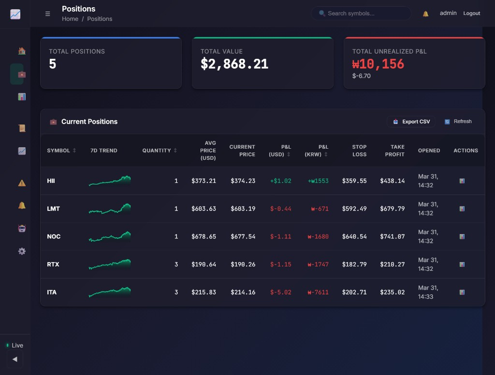
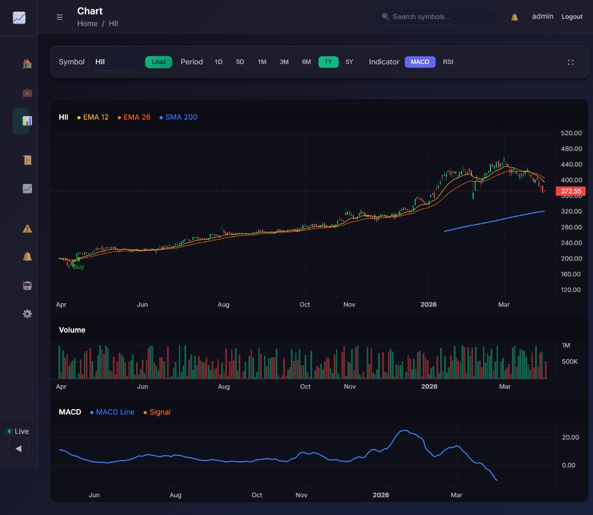
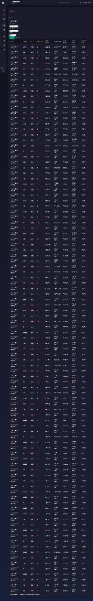

# UI Screenshots

Additional dashboard views for quick reference.

## Overview

Main dashboard snapshot showing account summary cards, portfolio chart, recent trades, and current positions.

## Positions View

Open positions table with per-position USD/KRW P&L and risk levels.

## Charts View

Candlestick chart with EMA 12/26, SMA 200, and MACD panels.

## Trading Log View

Full trade history table with symbol, side, quantity, and execution price details.

